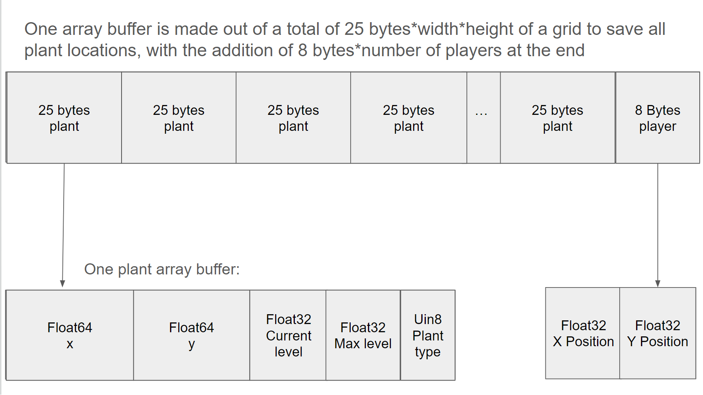

# GardenSimulator2023

### Previous devlogs entries:

- 11/17/2023 - introducing the team: https://github.com/MikaPS/GardenSimulator2023/tree/969395d396bd3d06578792227bb6261b358070af
- 11/21/2023 - f0: https://github.com/MikaPS/GardenSimulator2023/tree/4fc46044b69290cb4b10f7714747767303cfa75b
- 11/29/2023 - f1: https://github.com/MikaPS/GardenSimulator2023/tree/fb89b34f5511ffad84d5993a19eca70cb018ef2e
- 12/6/2023 - f2: https://github.com/MikaPS/GardenSimulator2023/commit/66a771bd4a1debcfc322bf0c8c3d570def574296
- 12/13/2023 - f3: https://github.com/MikaPS/GardenSimulator2023/commit/2d1f2ca9d4249a2de3af90edcfd9efe42cff6ba8

# Devlog Entry - 12/13/2023

## How we satisfied the software requirements

### F0+F1+F2

We still fulfill all of the original requirements, in similar ways to how we did them before.

### Internationalization

Instead of creating code to translate text on the spot, we put all different translations into a record. Once a language button is pressed, we keep track of the current language using `this.currentLanguage` and use it to parse the record by calling this function:

```typescript
export const LevelCompleteTranslation: Record<string, string> = {
  English: "Level \nComplete!",
  Hebrew: "!עברת שלב",
  Chinese: "关卡完成!",
};
```

The only file we added was `translation.ts` for easier management. Using that file, all we had to do was call it in `Play.ts`.

### Localization

The three languages this app supports are English, Chinese, and Hebrew. For English, all of the team members had knowledge of it. For Chinese, one of the team members had knowledge and help from their family to correctly put the text in. For Hebrew, one of the team members had knowledge and help from their friend to correctly put the text in. <br>

The default language is English, but can be changed by pressing the buttons on the top left of the interface. Once pressed, all text will be changed to that specific language. Instead of releasing three different versions of the game, we coded into the program to switch between languages depending on what button is pressed using an array.

We tried to not have a lot of text in the game, and instead used emojis to show the goals of the game. Before the requirement, we had buttons with text like `undo`, `redo`, and `savefile`, which we now switched to corresponding emojis. Moreover, to illustrate what plants the players need to collect to win, we use minimal text `emoji of plant x amount that needs to be collected`, so it would be understandable across languages.

### Mobile Installation

We used a Vite PWA Plug-in to get our game to be installable on a smartphone-class mobile device (only Androids are supported at the moment). The main file that we edited is `vite.config.ts` where we defined the manifest and icons for the app.

```typescript
  plugins: [
    VitePWA({
      manifest: {
        icons: [
          {
            src: "assets/tiny_turnip_512.png",
            sizes: "512x512",
            type: "image/png",
            purpose: "any maskable",
          },
          {
            src: "favicon.ico",
            sizes: "512x512",
            type: "image/x-icon",
            purpose: "any maskable",
          },
        ],
      },
    }),
  ],
  build: {
    outDir: "../wwwroot/",
    emptyOutDir: true,
  },
```

By building the vite project, the following files are created: `sw.js`, `registerSW.js`, `manifest.webmanifest`, etc. As well as changes were made to the `index.html` file. We followed a great tutorial video we saw online to get the mobile installation to work. We also included a radish picture as the app icon.

Links:

- https://www.youtube.com/watch?v=YSGLw4T8BgQ&t=300s&ab_channel=ShawnWildermuth

### Mobile Play (Offline)

We started the game with buttons being used for player movements and actions, so there was no need to change that. The game is usable on all devices. We used service workers for caching.

However, we had to change the `vite.config.ts` to ensure our images and YAML file would be parsed offline:

```typescript
 workbox: {
        runtimeCaching: [
          {
            urlPattern: ({ url }) => {
              return url.pathname.startsWith("/");
            },
            handler: "CacheFirst" as const,
            options: {
              cacheName: "api-cache",
              cacheableResponse: {
                statuses: [0, 200],
              },
            },
          },
        ],
      },
```

## Reflection

We added more feedback to the player, specifically a way to know which plants they need to collect to finish a level. The buttons for the plants available are also updated at each level based on the plants available. So, only sunflowers are available at level 1, while apple trees are added at level 2. The most recent requirements did not change a lot from the design perspective, but we had to change a bit of our code and the way we load assets into the game to make sure everything would show up in a mobile application as well. We had trouble making the game installable using Vite, so we experimented by changing the Vite tool in order to build and run the game. Ultimately, we decided that it would be too much work to change the build mechanic for the game, and we discovered the Vite PWA plug-in that greatly helped us finish the requirement. Overall, we had some ups and downs with the tools for these requirements, but we were able to use our original materials to complete all of the assignments.

# F2 Requirements:

### External DSL for Scenario Design

We are using YAML external DSL to set up our scenarios. We have three levels (level 1, 2, 3), each defining the available plants in the level and the winning conditions. We chose to use YAML over JSON because it was easier to read and edit, which allowed us to maneuver through the file and test things as needed.

```YAML
0:
  available_plants:
    - sunflower
  win_conditions:
    - - sunflower
      - 2
```

In the example, the numbered line that isn't indented represents a level (in this case level 0). Within it, lines that are indented once define the available plants and the winning conditions. Each level includes an extra plant so that there's an escalation in difficulty. For example, we can see in the line that is indented once inside `available plants` that we are only going to have sunflowers in level 0. The winning conditions are a little bit more complex; each plant has a number associated with it that represents the minimum amount of that plant players need to collect to win.

### Internal DSL for Plants and Growth Conditions

We created a plantDefinition internal DSL using TypeScript to create plants. Each plant type varies with different functions implementing the growth rate.

An easy way to create an array of all of our possible plant implementation is:

```typescript
allDummyPlants = allPlantDefinitions.map(internalPlantCompiler);
```

The plants are given a name (string), emoji (string), id (number), and a growthDefinition (function).

For example, when we create our sunflower plant, we use these definitions:

```typescript
function sunflower($: PlantDefinitionLanguage) {
    $.name("sunflower");
    $.emoji("🌻");
    $.plantID(1);
    $.growsWhen((ctx: GrowthContext) => {
      if (ctx.nearByDifferentPlants > 0) {
        return false;
      }
      if (ctx.nearBySamePlants <= 1) {
        return false;
      }

      return true;
    });
  },
```

The sunflower needs to be next to plants of the same type while having 0 plants of other types in order to grow

We also created a `PlacePlant` function that takes a location and an ID to easily add plants into the grid:

```typescript
  placePlant(point: Point, plantId: number) {
    const key = JSON.stringify(point);
    //Plant already exists at location
    if (this.gameState.has(key)) {
      return;
    }
    //Places a new plant
    const newPlant = internalPlantCompiler(allPlantDefinitions[plantId]);
    newPlant.point = point;
    this.gameState.set(key, newPlant); // updates the grid
  }
```

We decided to use an internal DSL instead of an external DSL because of the capabilities to create grow conditions during run-time using functions rather than predefined values. Explaining the different structures of growth rates using an external DSL (like YAML as explained before) would be challenging. Additionally, with interal DSLs, we can access and utilize libraries.

## Reflection

We reconsidered the growth conditions of each plant type to diversify them more so we can use an internal DSL to define them. With the inclusion plant definitions, we removed many fields in plant class as they became repetitive. Moreover, in previous versions, the winning conditions just checked the total number of plants in the inventory. Now the player will need to get a specific amount of each plant to progress to the next level. Thankfully, we didn't have to make too many different to our code, we mainly had to redesign the structure of the game.

# F1 Requirements (no major changes):

- **[F1.a] The important state of each cell of your game’s grid must be backed by a single contiguous byte array in AoS or SoA format. Your team must statically allocate memory usage for the whole grid.**
  We create a DataMap class that holds a single contiguous byte array that we use to allocate memory for the entire grid. Using dataview, we created a wrapper around the byte array so we could use regular functions on it (set, get, forEach, etc). Each location on the grid correlates to a buffer location which we get using this function: getBufferLocation(). We set the dataview at this buffer location to either 0 if we don't have a plant or to an array buffer that represents the plant. After going through all grid locations, we add the player to the byte array (save its location and ID in case we have multiple players). We have an AoS structure for the byte array where we save the information of each plant based on their position on the grid, so we have the full information of one location on the grid and then we save the information of the next cell.



- **[F1.b] The player must be able to undo every major choice (all the way back to the start of play), even from a saved game. They should be able to redo (undo of undo operations) multiple times.**
  We have undo and redo buttons that are available to the players. In the Play.ts file, we have two arrays that save each change that happens to the game. By keeping track of the player's previous actions, we allow them to undo every major choice in the game.

- **[F1.c] The player must be able to manually save their progress in the game in a way that allows them to load that save and continue play another day. The player must be able to manage multiple save files (allowing save scumming).**
  We created 3 save files for the players. Using buttons on screen, they can save or load three different states of the game. We implemented that by stringifying three array buffers, each representaing a different save file, and keeping them in local storage. The players can relax knowing that their progress is saved and they can manage it based on their needs.

- **[F1.d] The game must implement an implicit auto-save system to support recovery from unexpected quits. (For example, when the game is launched, if an auto-save entry is present, the game might ask the player "do you want to continue where you left off?" The auto-save entry might or might not be visible among the list of manual save entries available for the player to load as part of F1.c.)**<br>
  Upon closing a window, the game saves itself into one of the three save files. If the player last interacted with something in save file 1, we would automatically save the changes into that file. If the player opened the game for the first time, we use a default save file. Not only that, but upon opening the window, that last progress is restored and displayed on the screen.

# F0 requirements are the same as last week:

- **[F0.a] You control a character moving on a 2D grid** <br>
  We have a set of keys on the bottom of the screen, each arrow corresponds to a direction that you can move your character. We do by having a player class with a position field and a method that moves the player based on a given direction. This satisfies the requirements because the character can move in two dimensions, left or right, and up and down.

- **[F0.b] You advance time in the turn-based simulation manually.** Every move you make advances the world time. You can also click on the clock to advance time without having to make an action. This satisfies turn-based time simulation because the player can manually decide whether or not they want to progress the global time. Advancing the time affects the game state.

- **[F0.c] You can reap (gather) or sow (plant) plants on the grid when your character is near them.**
  By clicking the tractor icon while standing on top of a fully grown plant, the player harvests it, and it goes into the inventory on the right side of the screen. If the player is standing on top of a cell that has no plant inside of it, they can click a plant icon at the bottom of the screen to plant that kind of plant. We currently have 3 different types of plants that the player can choose from. This satisfies the requirements because players have the ability to both reap and sow plants.

- **[F0.d] Grid cells have sun and water levels. The incoming sun and water for each cell is somehow randomly generated - each turn. Sun energy cannot be stored in a cell (it is used immediately or lost) while water moisture can be slowly accumulated over several turns.**
  Each turn the sun is randomized and the global water is increased by 0-5 points. Every plant that is on screen uses 1 water to grow. If the player gets lucky and has enough sun and water energy, plants can level up. This satisfies the requirements because the sun energy is not stored in any tile and is randomly generated every turn. If the player has too many plants then they will deplete the water supply. So the Water slowly accumulates over every turn if the player does not have many plants, which ensures the players think about their actions before playing.

- **[F0.e] Each plant on the grid has a type (e.g. one of 3 species) and a growth level (e.g. “level 1”, “level 2”, “level 3”).**
  We have three plant types: apple tree, lily, and sunflower. Players can sow all three of these plants using the associated buttons on the screen. Each plant has a growth level shown by how much of the emoji is visible. Only when a plant is fully grown, it can be picked. Currently, there are 15 different "levels" of plant which corresponds to how much of the emoji is shown. This satisfies the requirement as there is visual indication of how much a plant is grown and each plant has numerous stages (1-15).

- **[F0.f] Simple spatial rules govern plant growth based on sun, water, and nearby plants (growth is unlocked by satisfying conditions).**
  If a plant has 2 or more plants within a cross around it, the plant is unable to grow at all. This satisfies the requirements because a plant will grow a set amount based on 3 conditions. The amount of water in the soil (which is affected by the total number of plants). The sun value (which is randomly generated every turn) and the number of nearby plants (if there are two or more plants nearby, then a plant is unable to grow)

- **[F0.g] A play scenario is completed when some condition is satisfied (e.g. at least X plants at growth level Y or above).** <br>
  When the player harvests 6 or more plants, the game is won and a helpful message appears. This satisfies the requirements as the scenario is effectively completed after 6 plants have been gathered.
